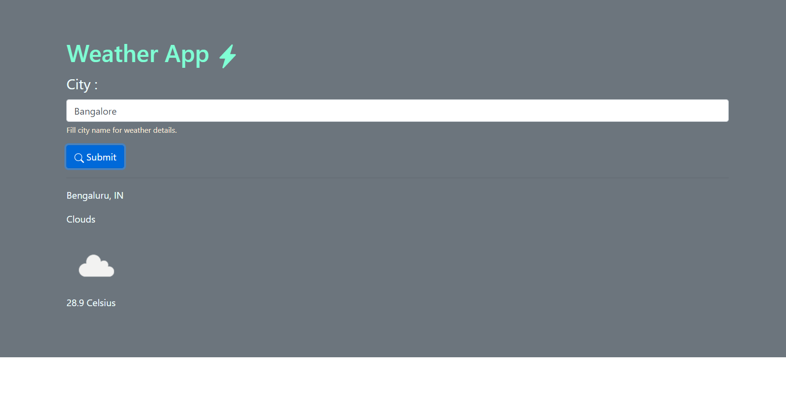

# Weather-api
Static website which uses Weather API.
This is a simple Webpage which displays some weather information about a city. It uses Bootstrap in front-end and JQuery to make AJAX calls from client side. 
OpenWeatherMap API is used here.

